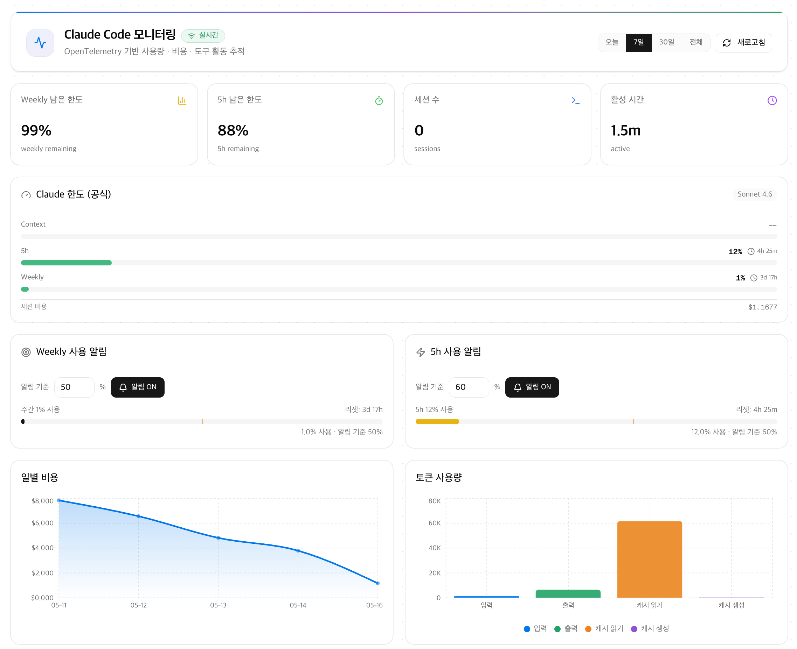

# Claude Code 모니터링 대시보드

Claude Code CLI의 사용량·비용·공식 한도를 **실시간**으로 시각화하는 로컬 모니터링 대시보드입니다.
OpenTelemetry OTLP 엔드포인트를 내장하여 별도 백엔드 없이 Next.js 단독으로 동작합니다.



---

## 주요 기능

| 기능                | 설명                                                                           |
| ------------------- | ------------------------------------------------------------------------------ |
| **실시간 스트리밍** | SSE(Server-Sent Events)로 10초마다 자동 갱신                                   |
| **공식 한도 패널**  | Claude가 Statusline에 내려주는 Context · 5h · Weekly 사용률 및 리셋 카운트다운 |
| **요약 카드**       | Weekly 남은 한도 % · 5h 남은 한도 % · 세션 수 · 활성 시간                      |
| **비용 차트**       | 일별 누적 비용 추이                                                            |
| **토큰 차트**       | 입력·출력·캐시 토큰 분리 차트                                                  |
| **모델 분포**       | 사용한 Claude 모델별 비율                                                      |
| **도구 활동**       | 실행된 Tool 빈도 분석                                                          |
| **이벤트 로그**     | 세션별 API 호출 이력 테이블                                                    |
| **알림**            | 5h 사용률 / Weekly 사용률이 설정 임계치를 넘으면 브라우저 알림                 |
| **기간 필터**       | 오늘 / 7일 / 30일 / 전체 전환                                                  |

---

## 기술 스택

| 영역        | 기술                               |
| ----------- | ---------------------------------- |
| 프레임워크  | Next.js 15 (App Router, Turbopack) |
| 언어        | TypeScript 5                       |
| 스타일링    | Tailwind CSS v4 + shadcn/ui        |
| 차트        | Recharts                           |
| 데이터 수집 | OpenTelemetry OTLP (HTTP/JSON)     |
| 스토리지    | 로컬 CSV 파일 (`/data/`)           |
| 패키지 관리 | pnpm                               |

---

## 사전 요구사항

- Node.js 20 이상
- pnpm (`npm install -g pnpm`)
- Claude Code CLI (Statusline 기능 포함)

---

## 설치 및 실행

```bash
# 저장소 클론
git clone <repo-url>
cd claude-monitoring

# 의존성 설치
pnpm install

# 개발 서버 실행 (http://localhost:3000)
pnpm dev
```

---

## Claude Code 연결 설정

대시보드 실행 후 Claude Code가 텔레메트리를 전송하도록 아래 설정을 추가합니다.

### 영구 설정 — `~/.claude/settings.json`

```json
{
  "env": {
    "CLAUDE_CODE_ENABLE_TELEMETRY": "1",
    "OTEL_METRICS_EXPORTER": "otlp",
    "OTEL_LOGS_EXPORTER": "otlp",
    "OTEL_EXPORTER_OTLP_PROTOCOL": "http/json",
    "OTEL_EXPORTER_OTLP_METRICS_ENDPOINT": "http://localhost:3000/api/otlp/metrics",
    "OTEL_EXPORTER_OTLP_LOGS_ENDPOINT": "http://localhost:3000/api/otlp/logs",
    "OTEL_METRIC_EXPORT_INTERVAL": "10000",
    "OTEL_LOGS_EXPORT_INTERVAL": "5000"
  }
}
```

설정 후 `claude` 명령을 실행하면 데이터가 자동으로 수집됩니다.

---

## 공식 한도 (Context · 5h · Weekly) 연동

Claude Code Statusline이 내려주는 **공식 사용률** 데이터를 캐시해 대시보드에 표시합니다.

### 동작 원리

1. Claude Code는 Statusline 명령 실행 시 stdin으로 `rate_limits` JSON을 전달합니다.
2. `~/.claude/statusline-wrapper.sh` 가 stdin을 가로채 필요한 필드만 `~/.claude/rate-limits-cache.json`(권한 600)에 원자적으로 저장합니다.
3. 기존 statusline 플러그인(claude-hud 등)으로 stdin을 그대로 전달하므로 기존 동작은 변경되지 않습니다.
4. 대시보드 `/api/usage/limits` 엔드포인트가 캐시를 읽어 15초마다 UI에 반영합니다.

### 설치

`~/.claude/settings.json`의 `statusLine` 항목을 아래와 같이 변경합니다.

```json
{
  "statusLine": {
    "type": "command",
    "command": "/Users/<your-username>/.claude/statusline-wrapper.sh"
  }
}
```

래퍼 스크립트(`statusline-wrapper.sh`)는 이 저장소에 포함되어 있지 않습니다.
스크립트 내용은 프로젝트 오너에게 문의하거나 직접 작성하세요.

> 캐시 파일에는 rate_limits, context 사용률, 세션 비용, 모델명, cwd basename만 저장됩니다.
> 전체 경로·API 키·대화 내용은 저장하지 않습니다.

---

## 알림 패널

| 패널             | 기준 데이터                 | 동작                           |
| ---------------- | --------------------------- | ------------------------------ |
| Weekly 사용 알림 | Claude 공식 Weekly 사용률 % | 설정한 % 초과 시 브라우저 알림 |
| 5h 사용 알림     | Claude 공식 5h 사용률 %     | 설정한 % 초과 시 브라우저 알림 |

각 패널에서 **알림 기준 %** 를 입력하고 **알림 ON** 을 누르면 활성화됩니다.

---

## 프로젝트 구조

```
claude-monitoring/
├── src/
│   ├── app/
│   │   ├── page.tsx                       # 메인 대시보드 페이지
│   │   └── api/
│   │       ├── otlp/
│   │       │   ├── metrics/route.ts       # OTLP 메트릭 수신 엔드포인트
│   │       │   └── logs/route.ts          # OTLP 로그 수신 엔드포인트
│   │       ├── stream/route.ts            # SSE 스트리밍 엔드포인트
│   │       ├── usage/
│   │       │   └── limits/route.ts        # 공식 한도 캐시 읽기 엔드포인트
│   │       └── local-stats/route.ts       # stats-cache.json 읽기 엔드포인트
│   ├── components/
│   │   ├── dashboard/
│   │   │   ├── summary-cards.tsx          # 요약 카드 (Weekly/5h 남은 %)
│   │   │   ├── usage-limits-panel.tsx     # Claude 공식 한도 패널
│   │   │   ├── budget-panel.tsx           # Weekly 사용 알림
│   │   │   ├── token-budget-panel.tsx     # 5h 사용 알림
│   │   │   ├── cost-chart.tsx
│   │   │   ├── token-chart.tsx
│   │   │   ├── model-chart.tsx
│   │   │   ├── tool-chart.tsx
│   │   │   └── events-table.tsx
│   │   └── ui/                            # shadcn/ui 기본 컴포넌트
│   ├── hooks/
│   │   └── use-live-data.ts               # SSE 구독 훅
│   └── lib/
│       ├── csv.ts                         # CSV 읽기·쓰기·정리 유틸리티
│       └── dashboard.ts                   # 데이터 집계 로직
└── data/
    ├── metrics.csv                        # 메트릭 데이터 (gitignore)
    └── events.csv                         # 이벤트 로그 (gitignore)
```

---

## 데이터 보관 정책

- CSV 파일이 **5 MB**를 초과하면 **30일** 이전 레코드를 자동 정리합니다.
- `/data/*.csv` 파일은 `.gitignore`에 포함되어 커밋되지 않습니다.
- `~/.claude/rate-limits-cache.json` 은 홈 디렉터리에 위치하며 권한 600으로 보호됩니다.

---

## 빌드 및 프로덕션 실행

```bash
pnpm build
pnpm start
```

pm2로 상시 실행하려면 `ecosystem.config.js`를 참고하세요.

---

## 라이선스

MIT
